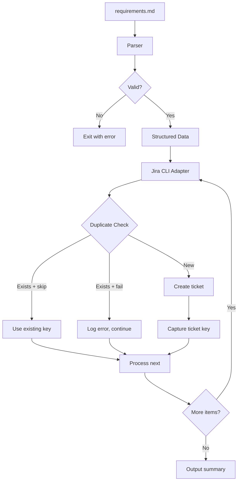
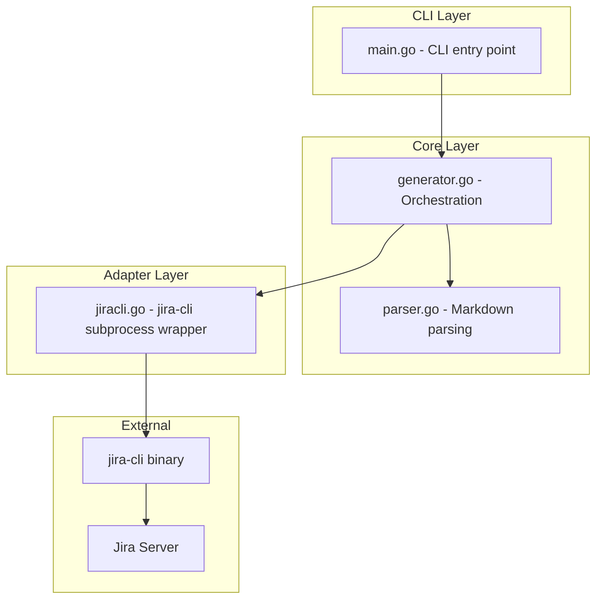
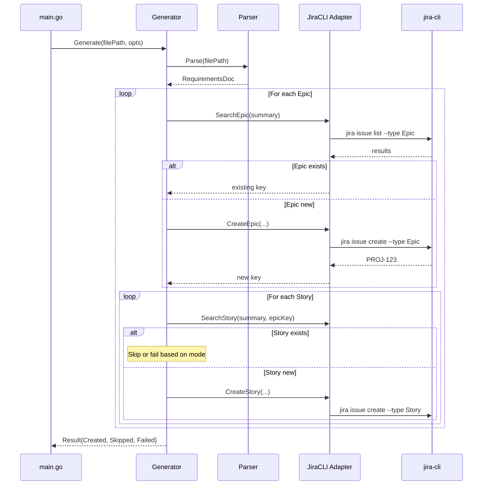
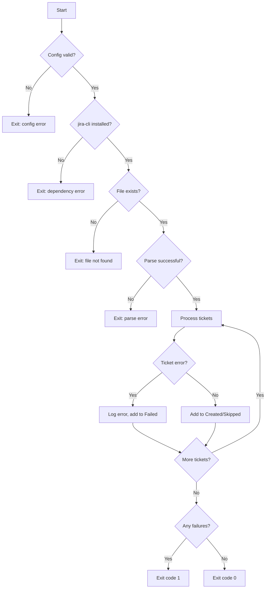

# Design Document: Jira Ticket Generator

## Overview

The Jira Ticket Generator (`jira-ticket`) is a Go CLI tool that automates Jira ticket creation from structured `requirements.md` files. It parses markdown documents to extract Epics and Stories, then creates corresponding Jira issues using `jira-cli` as the underlying Jira API interface.

### Key Design Goals

- **Idempotent operations**: Safe to run multiple times without creating duplicates
- **Graceful degradation**: Continue processing when individual tickets fail
- **Minimal dependencies**: Leverage existing `jira-cli` authentication and configuration
- **Agent-friendly**: Simple CLI interface suitable for automation and Kiro agent integration

### High-Level Flow



## Architecture

The tool follows a layered architecture with clear separation of concerns:



### Package Structure

```
jira-ticket/
├── cmd/
│   └── jira-ticket/
│       └── main.go          # CLI entry point, flag parsing
├── internal/
│   ├── parser/
│   │   ├── parser.go        # Markdown parsing logic
│   │   ├── parser_test.go   # Unit and property tests
│   │   └── types.go         # Epic, Story data structures
│   ├── generator/
│   │   ├── generator.go     # Orchestration logic
│   │   └── generator_test.go
│   └── jiracli/
│       ├── adapter.go       # jira-cli subprocess wrapper
│       ├── adapter_test.go
│       └── types.go         # Command result types
├── pkg/
│   └── config/
│       ├── config.go        # Environment variable loading
│       └── config_test.go
├── go.mod
├── go.sum
└── README.md
```

## Components and Interfaces

### Parser Component

The Parser extracts structured data from markdown files.

```go
package parser

// Epic represents a top-level Jira Epic parsed from a # heading
type Epic struct {
    Summary   string   // The heading text (without #)
    Priority  string   // Optional: extracted from **Priority:** field
    Assignee  string   // Optional: extracted from **Assignee:** field
    Stories   []Story  // Child stories under this epic
}

// Story represents a Jira Story parsed from a ## heading
type Story struct {
    Summary          string   // The heading text (without ##)
    Description      string   // Full content between this heading and next
    AcceptanceCriteria []string // Extracted acceptance criteria items
    Priority         string   // Optional: extracted from **Priority:** field
    Assignee         string   // Optional: extracted from **Assignee:** field
}

// RequirementsDoc represents the full parsed document
type RequirementsDoc struct {
    Epics []Epic
}

// Parser handles markdown parsing operations
type Parser interface {
    // Parse reads a requirements.md file and returns structured data
    Parse(filePath string) (*RequirementsDoc, error)
    
    // ParseContent parses markdown content directly (for testing)
    ParseContent(content string) (*RequirementsDoc, error)
    
    // Format converts structured data back to markdown (for round-trip testing)
    Format(doc *RequirementsDoc) string
}

// ParseError provides detailed error information
type ParseError struct {
    Line    int
    Message string
}
```

### Jira CLI Adapter Component

The adapter wraps `jira-cli` subprocess calls.

```go
package jiracli

// TicketResult represents the outcome of a ticket creation attempt
type TicketResult struct {
    Key     string // Jira ticket key (e.g., PROJ-123)
    Created bool   // true if newly created, false if existing
    Skipped bool   // true if skipped due to duplicate
    Error   error  // non-nil if creation failed
}

// SearchResult represents a found existing ticket
type SearchResult struct {
    Key     string
    Summary string
    Type    string // "Epic" or "Story"
}

// Adapter defines the interface for Jira CLI operations
type Adapter interface {
    // CreateEpic creates an Epic and returns the ticket key
    CreateEpic(summary, priority, assignee string) (*TicketResult, error)
    
    // CreateStory creates a Story linked to an Epic
    CreateStory(summary, description, epicKey, priority, assignee string) (*TicketResult, error)
    
    // SearchEpic finds an existing Epic by summary
    SearchEpic(summary string) (*SearchResult, error)
    
    // SearchStory finds an existing Story by summary under an Epic
    SearchStory(summary, epicKey string) (*SearchResult, error)
    
    // CheckInstalled verifies jira-cli is available
    CheckInstalled() error
}

// Config holds Jira connection settings
type Config struct {
    ProjectKey string // JIRA_PROJECT_KEY
    ServerURL  string // JIRA_SERVER_URL
}
```

### Generator Component

The generator orchestrates the overall process.

```go
package generator

// Options configures generator behavior
type Options struct {
    DryRun      bool   // Parse only, don't create tickets
    Verbose     bool   // Enable detailed logging
    OnDuplicate string // "skip" or "fail"
}

// Result summarizes the generation outcome
type Result struct {
    Created []string // Keys of newly created tickets
    Skipped []string // Keys of skipped duplicates
    Failed  []FailedTicket
}

// FailedTicket records a failed creation attempt
type FailedTicket struct {
    Summary string
    Type    string // "Epic" or "Story"
    Error   string
}

// Generator orchestrates ticket creation
type Generator interface {
    // Generate parses the file and creates tickets
    Generate(filePath string, opts Options) (*Result, error)
}
```

### Config Component

```go
package config

// Config holds all configuration values
type Config struct {
    ProjectKey string
    ServerURL  string
}

// Load reads configuration from environment and .env file
// System environment variables take precedence over .env
func Load() (*Config, error)

// Validate checks that all required configuration is present
func (c *Config) Validate() error
```

## Data Models

### Requirements File Format

The parser expects markdown following this structure:

```markdown
# Epic Title

Optional epic description text.

**Priority:** High
**Assignee:** username

## Story Title

Story description and context.

**Priority:** Medium
**Assignee:** another-user

### Acceptance Criteria

- Criterion 1
- Criterion 2
- Criterion 3

## Another Story

...

# Another Epic

...
```

### Internal Data Flow



### jira-cli Command Mapping

| Operation | jira-cli Command |
|-----------|------------------|
| Create Epic | `jira issue create -t Epic -s "Summary" -P PROJECT [-y priority] [-a assignee]` |
| Create Story | `jira issue create -t Story -s "Summary" -b "Description" -P PROJECT --parent EPIC-KEY [-y priority] [-a assignee]` |
| Search Epic | `jira issue list -t Epic -q 'summary ~ "exact text"' -P PROJECT --plain` |
| Search Story | `jira issue list -t Story -q 'summary ~ "exact text" AND parent = EPIC-KEY' -P PROJECT --plain` |


## Correctness Properties

*A property is a characteristic or behavior that should hold true across all valid executions of a system—essentially, a formal statement about what the system should do. Properties serve as the bridge between human-readable specifications and machine-verifiable correctness guarantees.*

### Property 1: Parse-Format Round Trip

*For any* valid `RequirementsDoc` structure, formatting it to markdown and then parsing the result SHALL produce an equivalent `RequirementsDoc` with the same Epics, Stories, and all their fields.

**Validates: Requirements 1.7**

### Property 2: Hierarchical Preservation

*For any* valid requirements markdown with Epics and Stories, parsing SHALL produce a `RequirementsDoc` where each Story appears in the `Stories` slice of its parent Epic (the most recent `#` heading above it), and no Story appears under a different Epic.

**Validates: Requirements 1.6**

### Property 3: Heading Extraction

*For any* valid requirements markdown, the number of `#` headings SHALL equal the number of Epics in the parsed result, and the number of `##` headings SHALL equal the total number of Stories across all Epics. Each heading's text (without the `#` prefix) SHALL match the corresponding `Summary` field.

**Validates: Requirements 1.1, 1.2, 2.2, 3.2**

### Property 4: Optional Field Extraction

*For any* Epic or Story section containing a `**Priority:**` or `**Assignee:**` field, the parsed structure SHALL have the corresponding field populated with the value following the field label.

**Validates: Requirements 1.8, 1.9**

### Property 5: Acceptance Criteria Inclusion

*For any* Story section containing acceptance criteria (bullet points under an "Acceptance Criteria" heading), the parsed Story's `AcceptanceCriteria` slice SHALL contain all those items, and when creating the Story in Jira, the description SHALL include all acceptance criteria text.

**Validates: Requirements 1.3, 3.3**

### Property 6: Error Resilience

*For any* set of Epics and Stories where some ticket creations fail (due to jira-cli errors), the generator SHALL attempt to create all remaining tickets. The count of attempted creations SHALL equal the total count of Epics plus Stories in the input.

**Validates: Requirements 2.3, 3.5, 5.1**

### Property 7: Optional Field Passing

*For any* Epic or Story with a non-empty `Priority` field, the jira-cli command SHALL include `-y <priority>`. *For any* Epic or Story with a non-empty `Assignee` field, the jira-cli command SHALL include `-a <assignee>`.

**Validates: Requirements 2.5, 2.6, 3.6, 3.7**

### Property 8: Epic-Story Linking

*For any* Story created in Jira, the jira-cli command SHALL include `--parent <epic-key>` where `<epic-key>` is the Ticket_Key of the Story's parent Epic (either newly created or found via duplicate detection).

**Validates: Requirements 3.4**

### Property 9: Dry-Run Mode

*For any* input file processed with `--dry-run` flag, zero jira-cli `issue create` commands SHALL be executed, and the result SHALL include the parsed structure without any created Ticket_Keys.

**Validates: Requirements 6.3**

### Property 10: Duplicate Skip Mode

*For any* Epic or Story whose summary matches an existing Jira issue (in skip mode), the generator SHALL not issue a create command for that item, SHALL use the existing Ticket_Key for subsequent operations (e.g., linking Stories to Epics), and SHALL include the item in the "skipped" count.

**Validates: Requirements 9.3, 9.4**

### Property 11: Duplicate Fail Mode

*For any* Epic or Story whose summary matches an existing Jira issue (in fail mode), the generator SHALL log an error for that item, SHALL not create a duplicate, and SHALL continue processing remaining items.

**Validates: Requirements 9.5**

### Property 12: Summary Accuracy

*For any* completed run, the `Result` struct SHALL contain: all newly created Ticket_Keys in `Created`, all skipped duplicate keys in `Skipped`, and all failed items with their error messages in `Failed`. The sum of these three counts SHALL equal the total number of Epics plus Stories in the input.

**Validates: Requirements 5.2, 5.4, 5.5, 9.7**

### Property 13: Exit Code Reflects Outcome

*For any* run where at least one ticket creation fails, the exit code SHALL be non-zero. *For any* run where all tickets are created or skipped successfully, the exit code SHALL be zero.

**Validates: Requirements 5.3**

### Property 14: Project Key in Commands

*For any* jira-cli command issued by the adapter (create or search), the command SHALL include `-P <project-key>` where `<project-key>` is the configured `JIRA_PROJECT_KEY` value.

**Validates: Requirements 7.5**

### Property 15: Ticket Key Extraction

*For any* successful jira-cli `issue create` command output containing a ticket key pattern (e.g., `PROJ-123`), the adapter SHALL extract and return that key. The returned key SHALL match the pattern `[A-Z]+-\d+`.

**Validates: Requirements 2.4, 7.3**

## Error Handling

### Error Categories

| Category | Example | Handling |
|----------|---------|----------|
| Configuration | Missing `JIRA_PROJECT_KEY` | Exit immediately with descriptive error |
| Dependency | jira-cli not installed | Exit immediately with installation instructions |
| File I/O | requirements.md not found | Exit with file path and error message |
| Parse | Invalid markdown structure | Exit with line number and parse error |
| Jira API | Network timeout, auth failure | Log error, continue with remaining tickets |
| Duplicate | Ticket already exists | Skip or fail based on `--on-duplicate` mode |

### Error Flow



### Error Messages

Errors should be actionable and include:
- What failed
- Why it failed (if known)
- How to fix it

```go
// Good error messages
"JIRA_PROJECT_KEY environment variable is not set. Set it or add to .env file."
"jira-cli not found in PATH. Install with: brew install jira-cli"
"requirements.md:15: Expected ## heading for Story, found ### heading"
"Failed to create Epic 'User Authentication': jira-cli error: unauthorized (401)"
```

## Testing Strategy

### Dual Testing Approach

This project uses both unit tests and property-based tests:

- **Unit tests**: Verify specific examples, edge cases, CLI behavior, and error conditions
- **Property tests**: Verify universal properties across randomly generated inputs

Both are complementary—unit tests catch concrete bugs while property tests verify general correctness.

### Property-Based Testing Configuration

- **Library**: [rapid](https://github.com/flyingmutant/rapid) - Go property-based testing library
- **Iterations**: Minimum 100 iterations per property test
- **Tagging**: Each test must reference its design property

```go
// Example property test structure
func TestParseFormatRoundTrip(t *testing.T) {
    // Feature: jira-ticket, Property 1: Parse-Format Round Trip
    rapid.Check(t, func(t *rapid.T) {
        doc := genRequirementsDoc(t)
        formatted := parser.Format(doc)
        reparsed, err := parser.ParseContent(formatted)
        require.NoError(t, err)
        require.Equal(t, doc, reparsed)
    })
}
```

### Test Organization

```
internal/
├── parser/
│   └── parser_test.go
│       ├── TestParseFormatRoundTrip          # Property 1
│       ├── TestHierarchicalPreservation      # Property 2
│       ├── TestHeadingExtraction             # Property 3
│       ├── TestOptionalFieldExtraction       # Property 4
│       ├── TestAcceptanceCriteriaInclusion   # Property 5
│       ├── TestParseFileNotFound             # Unit: 1.4
│       └── TestParseInvalidMarkdown          # Unit: 1.5
├── generator/
│   └── generator_test.go
│       ├── TestErrorResilience               # Property 6
│       ├── TestDryRunMode                    # Property 9
│       ├── TestDuplicateSkipMode             # Property 10
│       ├── TestDuplicateFailMode             # Property 11
│       ├── TestSummaryAccuracy               # Property 12
│       └── TestExitCodeReflectsOutcome       # Property 13
└── jiracli/
    └── adapter_test.go
        ├── TestOptionalFieldPassing          # Property 7
        ├── TestEpicStoryLinking              # Property 8
        ├── TestProjectKeyInCommands          # Property 14
        ├── TestTicketKeyExtraction           # Property 15
        ├── TestJiraCliNotInstalled           # Unit: 7.2
        └── TestJiraCliOutputParsing          # Unit: various outputs
```

### Generator Testing with Mocks

The `Adapter` interface enables testing the generator without calling jira-cli:

```go
type MockAdapter struct {
    CreateEpicFunc   func(summary, priority, assignee string) (*TicketResult, error)
    CreateStoryFunc  func(summary, description, epicKey, priority, assignee string) (*TicketResult, error)
    SearchEpicFunc   func(summary string) (*SearchResult, error)
    SearchStoryFunc  func(summary, epicKey string) (*SearchResult, error)
}
```

### Random Data Generators

For property tests, implement generators for:

```go
// Generate random valid RequirementsDoc
func genRequirementsDoc(t *rapid.T) *parser.RequirementsDoc

// Generate random Epic with optional fields
func genEpic(t *rapid.T) parser.Epic

// Generate random Story with acceptance criteria
func genStory(t *rapid.T) parser.Story

// Generate random valid markdown content
func genMarkdownContent(t *rapid.T) string

// Generate jira-cli output with ticket key
func genJiraCliOutput(t *rapid.T) string
```

### Unit Test Coverage

Unit tests should cover:

1. **CLI argument parsing**: `--help`, `--dry-run`, `--verbose`, `--on-duplicate`, positional args
2. **Configuration loading**: env vars, .env file, precedence, missing required vars
3. **Error conditions**: file not found, invalid markdown, jira-cli not installed
4. **Edge cases**: empty file, file with only Epics (no Stories), deeply nested content
5. **jira-cli output parsing**: various output formats, error outputs

### Integration Testing

For integration tests (optional, requires jira-cli setup):

```bash
# Run with test Jira project
JIRA_PROJECT_KEY=TEST go test -tags=integration ./...
```

Integration tests should:
- Use a dedicated test project
- Clean up created tickets after tests
- Be skipped in CI unless credentials are available
